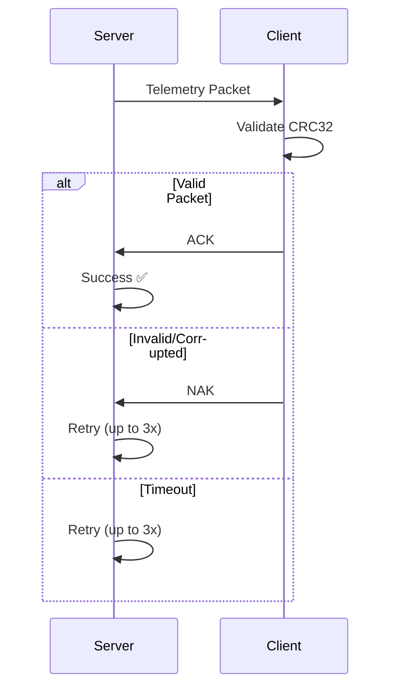

# 🚀 Reliable Telemetry over UDP

> A robust implementation of reliable communication over unreliable UDP, featuring CRC validation and ACK/NAK retry logic. Perfect for understanding embedded systems communication patterns.

## ✨ Features

🔒 **CRC32 Validation** - Detects corrupted packets using IEEE 802.3 standard  
🔄 **ACK/NAK Protocol** - Simple acknowledgment system for guaranteed delivery  
⚡ **Automatic Retries** - Smart retry logic with exponential backoff  
⏱️ **Timeout Handling** - Configurable timeouts for responsive communication  
🔍 **Duplicate Detection** - Handles out-of-order and duplicate packets gracefully  
🎯 **Modern C++** - Clean, maintainable code following best practices  

## 📁 Project Structure

```
reliable-telemetry/
├── 📂 include/
│   └── protocol.h          # 🔧 Protocol definitions & constants
├── 📂 src/
│   ├── server.cpp          # 📡 Telemetry server implementation
│   ├── client.cpp          # 📱 Telemetry client implementation
│   └── crc32.cpp           # 🛡️ CRC32 utility functions
├── 📂 build/               # 🏗️ Compiled executables
├── Makefile               # ⚙️ Build configuration
├── README.md              # 📖 This file
└── .gitignore            # 🚫 Git ignore rules
```

## 🚀 Quick Start

### Build & Run
```bash
# Build everything
make

# Run automated test
make test

# Or run manually in separate terminals:
./build/telemetry_client    # Terminal 1
./build/telemetry_server    # Terminal 2
```

### Sample Output
```
Client: Packet ID: 0 | Temp: 23.4°C | Pressure: 1.1 atm | Voltage: 3.3V
Server: Successfully sent packet ID 0
Client: Packet ID: 1 | Temp: 24.1°C | Pressure: 1.0 atm | Voltage: 3.2V
Server: Successfully sent packet ID 1
```

## 📡 Protocol Specification

### 📦 Telemetry Packet
| Field     | Type     | Description                    |
|-----------|----------|--------------------------------|
| Type      | uint8_t  | Packet type (0x01 = TELEMETRY)|
| ID        | uint16_t | Unique packet identifier       |
| Timestamp | uint32_t | Milliseconds since start       |
| Sensor1   | float    | Temperature (°C)               |
| Sensor2   | float    | Pressure (atm)                 |
| Sensor3   | float    | Voltage (V)                    |
| CRC32     | uint32_t | IEEE 802.3 checksum            |

### ✅ ACK/NAK Packet
| Field  | Type     | Description                     |
|--------|----------|---------------------------------|
| Type   | uint8_t  | ACK (0x02) or NAK (0x03)        |
| ACK ID | uint16_t | ID of acknowledged packet       |
| CRC32  | uint32_t | Packet integrity checksum       |

## 🔄 Reliability Flow



## ⚙️ Configuration

All settings in `include/protocol.h`:

```cpp
constexpr int SERVER_PORT = 8080;      // Server listening port
constexpr int CLIENT_PORT = 8081;      // Client listening port  
constexpr int TIMEOUT_MS = 1000;       // ACK timeout (1 second)
constexpr int MAX_RETRIES = 3;         // Maximum retry attempts
```

## 🏗️ Architecture Highlights

- **🔧 Separation of Concerns**: Clean protocol/network/application layers
- **🛡️ Error Handling**: Comprehensive validation and recovery
- **♻️ Resource Management**: RAII principles for socket lifecycle
- **🧪 Testability**: Modular design enables easy unit testing
- **📊 Observability**: Detailed logging for debugging and monitoring

## 🎯 Use Cases

This implementation demonstrates patterns commonly used in:
- 🛰️ **Satellite Communications** (like Starshield)
- 🚗 **Automotive Systems** (CAN bus reliability layers)
- 🏭 **Industrial IoT** (sensor data collection)
- 🎮 **Real-time Gaming** (state synchronization)
- 📡 **Embedded Systems** (reliable data transmission)

## 🛠️ Development

```bash
# Clean build
make clean

# Debug build with symbols
make CXXFLAGS="-std=c++11 -Wall -Wextra -g -O0"

# Release build with optimizations  
make CXXFLAGS="-std=c++11 -Wall -Wextra -O3 -DNDEBUG"
```

---

<div align="center">

**Built with ❤️ for learning embedded communication patterns**

*Perfect for understanding how reliability layers work in real-world systems*

</div>